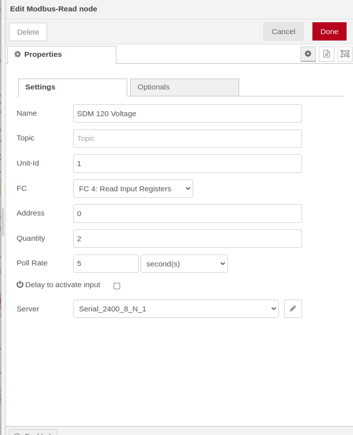

---

# node-red-contrib-energy-meter

`node-red-contrib-energy-meter` is a Node-RED node that provides advanced functionality for interpreting and transforming data from SDM series energy meters. It utilizes `ArrayBuffer` to accurately process and combine the high and low payload segments from the incoming message, producing a precise `Float32` output value. Refer the modbus node settings below to make it work




## 🚀 Installation

To install `node-red-contrib-energy-meter` node, you can either use the Node-RED's built-in palette manager or via npm:

```
npm install node-red-contrib-energy-meter
```

After installing, you may need to restart Node-RED to load the new node.

## 📖 Usage

Once installed, the "energy-meter" node will be available in the function category of your Node-RED flow editor. This node requires an input message with a payload that includes high and low values from an SDM series energy meter. The transformed output can then be wired to the nodes of your choice.

## 📈 Example

Follow the steps below to utilize this node:

1. Install the node.
2. Navigate to the Node-RED flow editor.
3. Drag and drop the "energy-meter" node from the function category into your flow.
4. Connect the "energy-meter" node to the other nodes as required by your flow.

## 👏 Contributing

Contributions to `node-red-contrib-energy-meter` are welcome! If you wish to contribute, please create a pull request. For substantial changes, please open an issue first to discuss your proposed changes.

## 📃 License

This project is licensed under the GPL-3.0 License. See the [LICENSE](LICENSE) file for details.

## 👤 Author

`node-red-contrib-energy-meter` was created by Harshad Joshi. Connect with me on GitHub [@hj91](https://github.com/hj91).

---

## Testing 

This node  was tested with Eastron SDM 120CT energy meter. Please submit patches in case it does not work for other meters from the manufacturer. Note - you will be required to install node-red-contrib-modbus to read modbus data from energy meter. This node only translates modbus data into Human readable format. 
